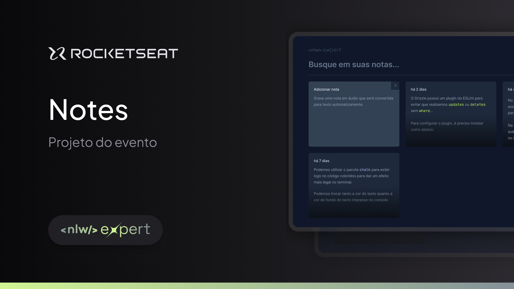

<p align="center">
  
</p>

<p align="center">Projeto desenvolvido durante a NLW Expert da Rocketseat na trilha React.</p>

<p align="center">
  
</p>

<br>

## Tópicos
- [Imagem do projeto](#img)
- [Sobre o projeto](#sobre)
- [Tecnologias utilizadas](#tec)
- [Executando o projeto](#execute)
- [Status do projeto](#status)
- [Licença](#license)

<br>

<h2 id="img">📸 Imagem do projeto</h2>



<br>

<h2 id="sobre">📖 Sobre o projeto</h2>

<p align="justify">É uma aplicação para criar e excluir notas. As notas podem ser criadas por voz, utilizando a Speech Recognition API (se o navegador tiver suporte), ou simplesmente digitando.</p>

<br>

<h2 id="tec">🤖 Tecnologias utilizadas</h2>

* React
* Tailwind CSS
* TypeScript
* SpeechRecognition API
* Git e Github

<br>

<h2 id="execute">📋 Executando o projeto</h2>

<h3>Pré-requisito</h3>

* [NodeJS LTS](https://nodejs.org/en/)

<h3>Passo a passo</h3>

```bash
# Clone este repositório
$ git clone https://github.com/Fel1324/NLW-Expert-Notes.git

# Acesse a pasta do projeto no terminal/cmd
$ cd NLW-Expert-Notes

# Instale as dependências do projeto
$ npm install

# Execute o projeto
$ npm run dev
```
Para visualizar o projeto, acesse [http://localhost:5173](http://localhost:5173)

<br>

<h2 id="status">🚧 Status do projeto</h2>

Projeto finalizado ✅

<br>

<h2 id="license">📝 Licença</h2

Esse projeto está sob a licença MIT.

---

Feito com ♥ by Rocketseat :wave: [Participe da nossa comunidade!](https://discord.gg/rocketseat)
